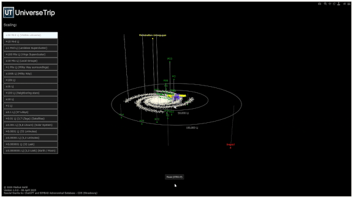

# UniverseTrip - A trip into the structure of the universe

UniverseTrip ist ein interaktives 3D-Visualisierungsprogramm zur Darstellung kosmischer Objekte im gesamten sichtbaren Universum. 

Die dargestellten Objekte können über eine Objekt-Datei vom Benutzer beliebig erstellt und angepasst werden. Die Objekte werden im dreidimensionalen Raum maßstabsgetreu an der richtigen Stelle dargestellt, sodass die räumlichen Zusammenhänge erkennbar werden. Mithilfe der intuitiven Bedienung mit der Maus und dem Mausrad, kann vom Erde-Mond System bishin zum sichtbaren Universum gezoomt und navigiert werden. Das Visualisierungsprogramm wird nach der Konfiguration der Anzeige im Standardbrwoser geöffnet.

Dieses Repository enthält optional auch einen separaten Object-List-Creator, mit dessen Hilfe die Objekt-Dateien konfiguriert und automatisch erstellt werden können. Als Input für diesen Objekt-List-Creator dienen mehrere zur Verfügung gestellte Datenbank-Datein, die die aufbereiteten Objektdaten aus der astronomischen Datenbank SIMBAD enthalten. Es können jederzeit weitere Datenbank-Dateien manuell hinzugefügt werden.

---

## Features

### UniverseTrip
- 3D-Visualisierung kosmischer Objekte vom Erde-Mond-System bishin zum gesamten sichtbaren Universum
- Intuitive Navigation mit der Maus und dem Mausrad durch den dreidimensionalen Raum
- Dargestellte Objekte werden durch eine Objektdatei im CSV-Format definiert
- Die CSV-Objektdatei kann je nach Bedürfnis beliebig mit dem Object-List-Creator erstellt und manuell verändert werden
- Konfiguration der Anzeige über ein GUI

### UniverseTrip Object-List-Creator
- Erstellung von Objektdatein auf Basis von auswählbarer Objektdatenbank-Dateien
- Filterfunktionen, um nur bestimmt Objekte zu berücksichtigen
- Benutzerdefinierter Dateiname für Ausgabedatei (Objektdatei)

---

## Projektstruktur

- /universe-trip/ 
- .../object_database/                    # Objektdatenbanken, als Input für die Erstellung der Objektdatein
- ...app_data/                            # Datein, die für die Ausführung des Programmes notwendig sind
- ...UniverseTrip.py                      # Visualisierungsprogramm
- ...UniverseTrip_ObjectListCreator.py    # Programm für die Generierung von Objektdatein
- ...README.md                            # readme
- ...LICENSE                              # Lizenzfile
- ....gitignore                           # .gitignore file
- ...objects_HR.csv                       # Objekt-Datei für den HR Katalog
- ...objects_Messier.csv                  # Objekt-Datei für den Messier Katalog
- ...objects_NGC.csv                      # Objekt-Datei für den NGC Katalog

---

## Installation

Installation unter Windows:
- Download und Installation von Python über https://www.python.org/downloads/
- Öffnen der Eingabeaufforderung
- Navigation zum Ordner, in der PIP.exe enthalten ist. Typischer Weise "cd C:\Users\"USER"\AppData\Local\Programs\Python\Python313\Scripts"
- Installation der notwendigen Zusatzpakete über die Befehle
- pip install pandas
- pip install plotly
- pip install numpy
- pip install pillow
- pip install astropy
- Öffnen des Visualisierungsprogramms und des Object-List-Creators per Doppelklick auf die .py Datei.

---

## Verwendung
### 1. Objektdatei erstellen (optional)
Die angezeigten Objekte werden in einer objects_*.csv Datei definiert. Eine Objektdatei kann manuell durch Zusammenkopieren von vorhanden Objektdatein erstellt werden oder Toolunterstützt mit dem UniverseTrip_ObjectListCreator.py.

 - UniverseTrip_ObjectListCreator.py öffnen
 - Datenbankdatei aus dem Ordner /object_database/ öffnen
 - Konfiguration, welche Objekte in die object_x.csv Datei übernommen werden sollen
 - Definition des Namnes der Objektdatei
 - Durch Klick auf "Create file" wird die Objektdatei erstellt

### 2. Visualisierung starten
- UniverseTrip.py öffnen
- Objektdatei auswählen
- Konfiguration der Anzeigeoptionen
- Mit Klick auf Button "GO!" wird die Visualisierung im Standardbrwoser geöffnet. Das Laden kann je nach Anzahl der Objekte und Rechenleistung mehrere Sekunden dauern. Bitte um etwas Geduld.

---
## Mitgelieferte Objektdaten
FÜr die Erstellung der Objektdaten sind im Ordner "/object_database/" Objektdaten aus verschiedenen astronomischen Katalogen zur Verfügung gestellt.
Um das Programm auf einfache Art direkt verwenden zu können, sind im Ordner Projektverzeichnis bereits beispielhafte Objektdatein mit dem Namen "objects_xxx.csv" zu finden.  

objects_Solarsystem.csv - Objekte des Sonnensystems
objects_Supercluster.csv - Zusammenstellung der Galaxienhaufen
objects_NGC.csv - NGC Katalog (Alle Objekte des NGC Katalogs)
objects_HR.csv - HR Katalog (Alle Sterne die Heller als 6,5mag sind)
objects_M.csv - Messier Katalog (Alle Objekte des Messier Katalogs)
objects_UniverseTrip.csv - UniverseTrip Zusammenstellung (Zusammenfassung der schönsten und erwähnenswerten Objekte sowie eine Darstellung der Superhaufen)

---

## Format der Objektdatein
### Objektdateien
Die Objektdateien müssen im .csv Format vorliegen (Trennzeichen ",") und folgende Spalten enthalten:
- object_name --> Name des Objekts
- galactic_l_deg --> Galaktische Länge des Objekts in Grad
- galactic_b_deg --> Galaktische Breite des Objekts in Grad
- distance_to_sun_Lj --> Abstand zum Sonnensystem in Lichtjahren
- brightness_mag --> Visuelle Helligkeit in Magnituden
- object_type --> Objekttyp

### Objektdatenbanken
Die Objektdatenbank Datei muss im .xlsx Format vorliegen.
Die Daten müssen in einem Tabellenblatt namens "Consolidation" enthalten sein.
Das Tabellenblatt muss folgende Spalten enthalten:
- id --> Name des Objektes
- otype --> Objekttyp laut Simbad Datenbank
- ra --> RA Koordinate in Grad
- dec --> DEC Koordinate in Grad
- distLj_mean --> Entfernung in Lichtjahren
- V --> Visuelle Helligkeit in Magnituden

---
## Lizenz
GNU General Public License, Version 3 (GPL v3) – siehe LICENSE Datei.

---
## Mitmachen
Du hast Ideen oder Verbesserungsvorschläge? Gerne! Issues und Pull Requests sind willkommen!
