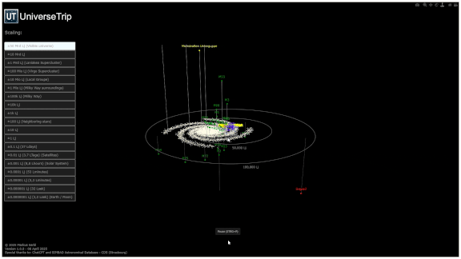

# UniverseTrip - Experience the depth of space

UniverseTrip is an interactive 3D visualization program for displaying cosmic objects throughout the entire observable universe.

The displayed objects can be freely created and customized by the user via an object file. The objects are shown to scale in the correct position within three-dimensional space, making spatial relationships clearly visible. With intuitive mouse and scroll wheel controls, users can zoom and navigate from the Earth-Moon system all the way out to the observable universe. Once the display settings have been configured, the visualization program opens in the default web browser.

This repository optionally includes a separate Object List Creator, which can be used to configure and automatically generate the object files. As input, this Object List Creator uses several provided database files containing processed object data from the astronomical SIMBAD database. Additional database files can be manually added at any time. The Simbad-Database query are available in the database-files.

---

## Features

### UniverseTrip
- 3D visualization of cosmic objects from the Earth-Moon system to the entire observable universe
- Intuitive navigation through 3D space using the mouse and scroll wheel
- Displayed objects are defined via an object file in CSV format
- The CSV object file can be freely created and manually modified as needed using the Object List Creator
- Display configuration via a graphical user interface (GUI)

### UniverseTrip Object-List-Creator
- Creation of object files based on selectable object database files
- Filtering functions to include only specific objects
- User-defined filename for the output file (object file)

---

## Project structure

- /universe-trip/
- .../object_database/    # Object databases used as input for generating object files
- .../app_data/           # Files required to run the program
- ...UniverseTrip.py      # Visualization program
- ...UniverseTrip_ObjectListCreator.py # Program for generating object files
- ...README.md            # Readme
- ...LICENSE              # License file
- ....gitignore           # .gitignore file
- ...objects_HR.csv       # Object file for the HR catalog (all stars brighter then 6.5mag)
- ...objects_Messier.csv  # Object file for the Messier catalog (Messier objects)
- ...objects_NGC.csv      # Object file for the NGC catalog (NGC objects)
---

## Installation

Installation on Windows:
- Download and install Python from https://www.python.org/downloads/
- Open the Command Prompt
- Navigate to the folder containing pip.exe. Typically: cd C:\Users\"USER"\AppData\Local\Programs\Python\Python313\Scripts
- Install the required packages using the following commands:
 - pip install pandas
 - pip install plotly
 - pip install numpy
 - pip install pillow
 - pip install astropy
- Launch the visualization program and the Object List Creator by double-clicking the respective .py file.

---

## Usage
### 1. Create an Object File (optional)
The displayed objects are defined in an objects_*.csv file. An object file can either be created manually by combining existing object files, or with tool support using UniverseTrip_ObjectListCreator.py.

- Open UniverseTrip_ObjectListCreator.py
- Open a database file from the /object_database/ folder
- Configure which objects should be included in the object_x.csv file
- Define the name of the object file
- Click on "Create file" to generate the object file

### 2. Start the Visualization
- Open UniverseTrip.py
- Select the object file
- Configure the display options

Click the "GO!" button to launch the visualization in the default web browser. Depending on the number of objects and your system’s performance, loading may take several seconds. Please be patient.

---

## Included Object Data

To support object file creation, the `/object_database/` folder contains object data from various astronomical catalogs.  
To allow easy and immediate use of the program, several example object files named `objects_xxx.csv` are already provided in the project directory:

| File Name                    | Description                                                                 |
|-----------------------------|-----------------------------------------------------------------------------|
| `objects_Solarsystem.csv`   | Objects of the Solar System                                                 |
| `objects_Supercluster.csv`  | Compilation of galaxy clusters                                              |
| `objects_NGC.csv`           | NGC catalog (all objects from the NGC catalog)                              |
| `objects_HR.csv`            | HR catalog (all stars brighter than 6.5 mag)                                |
| `objects_M.csv`             | Messier catalog (all objects from the Messier catalog)                      |
| `objects_UniverseTrip.csv` | UniverseTrip compilation (a selection of the most beautiful and noteworthy objects, including a representation of the superclusters) |

---

## Format of Object Files
### Object Files  
Object files must be in `.csv` format (delimiter: ",") and contain the following columns:  
- `object_name` --> Name of the object  
- `galactic_l_deg` --> Galactic longitude of the object in degrees  
- `galactic_b_deg` --> Galactic latitude of the object in degrees  
- `distance_to_sun_Lj` --> Distance to the solar system in light years  
- `brightness_mag` --> Visual brightness in magnitudes  
- `object_type` --> Object type  

### Object Databases  
The object database file must be in `.xlsx` format.  
The data must be contained in a worksheet named **"Consolidation"**.  
The worksheet must include the following columns:  
- `id` --> Name of the object  
- `otype` --> Object type according to the Simbad database  
- `ra` --> RA coordinate in degrees  
- `dec` --> DEC coordinate in degrees  
- `distLj_mean` --> Distance in light years  
- `V` --> Visual brightness in magnitudes  

---
## License
GNU General Public License, Version 3 (GPL v3) – see the LICENSE file.
